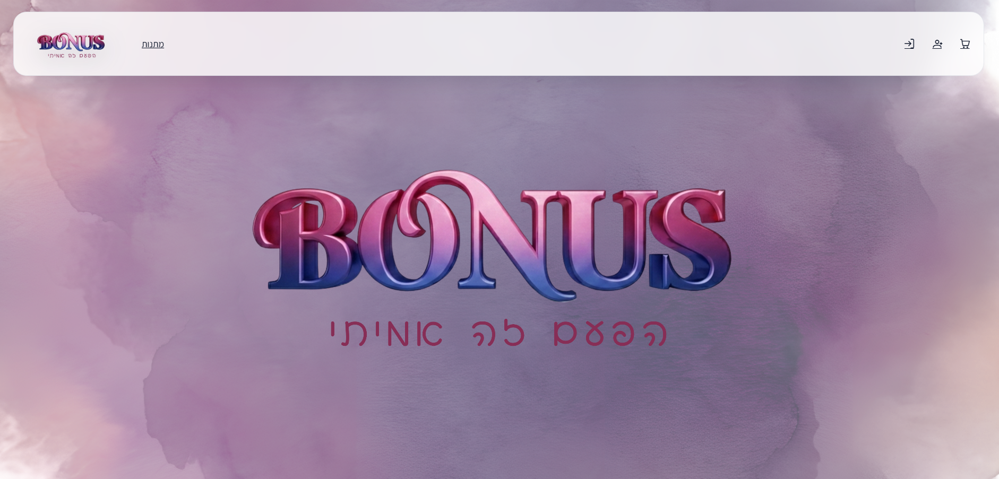
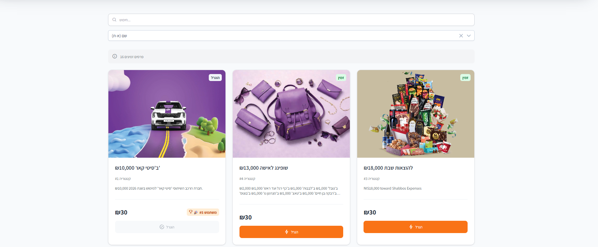
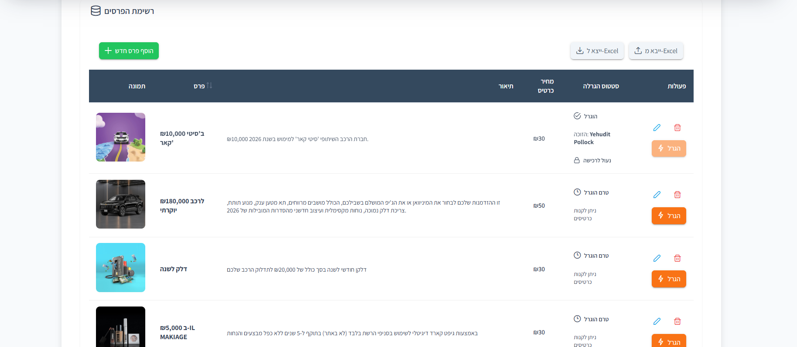
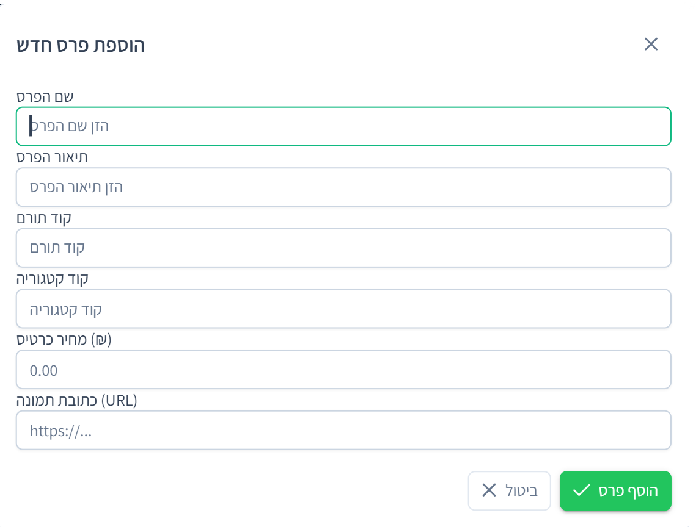
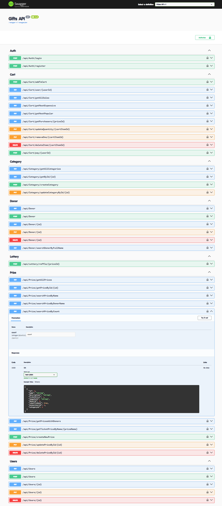

# 🎁 Gift Raffle Platform

[](#)
[](#)
[](#)
[](#)
[](#)

A full‑stack raffle & gifts management system built with **Angular** (client) and **ASP.NET Core Web API** (server), backed by **SQL Server**.  
Includes authentication/authorization with **JWT**, a layered architecture (Controllers → Services → Repositories), and **EF Core Migrations**.

---

## 📚 Table of Contents
- [Key Features](#-key-features)
- [Architecture](#-architecture)
- [Tech Stack](#-tech-stack)
- [Project Structure](#-project-structure)
- [Quick Start](#-quick-start)
  - [Server Configuration (Secrets)](#-server-configuration-secrets)
  - [Database & Migrations](#-database--migrations)
  - [Run the Server](#-run-the-server)
  - [Run the Client](#-run-the-client)
- [Swagger](#-swagger)
- [Troubleshooting](#-troubleshooting)
- [Screenshots](#-screenshots)
- [Roadmap](#-roadmap)
- [Author](#-author)

---

## ✨ Key Features
- 🔐 Register / Login
- 🧾 JWT Authentication + Authorization
- 👥 Role‑based access (Admin / User)
- 🎟 Raffle / Lottery management
- 🏷 Categories management
- 🎁 Prizes management
- 💝 Donors management
- 🛒 Cart & checkout flow
- 🧱 Clean REST API + layered architecture (Controllers / Services / Repositories)
- 🗄 EF Core + Migrations

---

## 🏗 Architecture
```
Angular SPA  →  ASP.NET Core Web API  →  SQL Server
         Auth: JWT         ORM: EF Core
```

---

## 🛠 Tech Stack

### Frontend
- Angular 20 (TypeScript, HTML, SCSS)
- PrimeNG / PrimeFlex

### Backend
- .NET 9 (ASP.NET Core Web API)
- Entity Framework Core (SQL Server provider)
- JWT Bearer Authentication
- Swagger (OpenAPI)
- Serilog (Console + rolling file logs)

### Database
- Microsoft SQL Server

---

## 📂 Project Structure
```
gift-raffle-platform/
│
├── client/                 # Angular app
│   ├── src/
│   ├── public/
│   └── package.json
│
└── server/                 # .NET solution
    ├── ex1.sln
    └── ex1/
        ├── Controllers/
        ├── Services/
        ├── Repository/
        ├── Data/
        ├── Models/
        ├── Migrations/
        └── Program.cs
```

---

## 🚀 Quick Start

### 1) Clone
```bash
git clone https://github.com/yt314/gift-raffle-platform.git
cd gift-raffle-platform
```

---

## 🔑 Server Configuration (Secrets)

This repository **does not commit** local settings files (e.g., `appsettings.json`) and **never** commits secrets.

The server expects:
- `ConnectionStrings:DefaultConnection`
- `RateLimiting:JwtSettings:Issuer`
- `RateLimiting:JwtSettings:Audience`
- `RateLimiting:JwtSettings:SecretKey`

> Note: The JWT section key is **RateLimiting:JwtSettings** in `Program.cs`.

### Option A — User Secrets (recommended for local dev)
**PowerShell (Windows):**
```powershell
cd server\ex1
dotnet user-secrets init

dotnet user-secrets set "ConnectionStrings:DefaultConnection" "Server=.;Database=GiftRaffleDb;Trusted_Connection=True;TrustServerCertificate=True;"
dotnet user-secrets set "RateLimiting:JwtSettings:Issuer" "GiftRaffleApi"
dotnet user-secrets set "RateLimiting:JwtSettings:Audience" "GiftRaffleClient"
dotnet user-secrets set "RateLimiting:JwtSettings:SecretKey" "PUT_A_STRONG_SECRET_KEY_HERE"
```

### Option B — Environment Variables
**PowerShell:**
```powershell
$env:ConnectionStrings__DefaultConnection="Server=.;Database=GiftRaffleDb;Trusted_Connection=True;TrustServerCertificate=True;"
$env:RateLimiting__JwtSettings__Issuer="GiftRaffleApi"
$env:RateLimiting__JwtSettings__Audience="GiftRaffleClient"
$env:RateLimiting__JwtSettings__SecretKey="PUT_A_STRONG_SECRET_KEY_HERE"
```

---

## 🗄 Database & Migrations
From `server\ex1`:

> If `dotnet ef` is missing, install it once:
```bash
dotnet tool install --global dotnet-ef
```

Then run:
```bash
dotnet tool restore
dotnet ef database update
```

---

## 🖥 Run the Server
From the repository root:

```bash
cd server
dotnet restore
dotnet build
dotnet run --project ex1
```

Default URLs (from `launchSettings.json`):
- `http://localhost:5274`
- `https://localhost:7063`

---

## 🌐 Run the Client
From the repository root:

```bash
cd client
npm ci
ng serve
```

Client URL:
- `http://localhost:4200`

---

## 📘 Swagger
When the server is running:
- Swagger UI: `http://localhost:5274/swagger`

---

## 🧯 Troubleshooting

### Node / npm issues
Check installed versions:
```bash
node -v
npm -v
```
If `npm ci` fails, try:
```bash
npm install
```

### CORS blocked requests
The server includes a CORS policy for:
- `http://localhost:4200`

If you change the client URL/port, update the allowed origin in `Program.cs`.

### Database connection errors
- Make sure SQL Server is running
- Verify `DefaultConnection`
- Re-run migrations:
```bash
cd server/ex1
dotnet ef database update
```

---

## 📸 Screenshots

### Home


### Browse Prizes / Raffles


### Login


### Admin Dashboard


### Create Prize (Admin)


### Swagger (API Documentation)


---

## 🧭 Roadmap
- Move API base URL in Angular to `environment.ts` (avoid hardcoded localhost)
- Add automated tests (unit/integration)
- Add Docker (API + SQL Server + client)
- Add CI workflow (build + test on PR)

---

## 👩‍💻 Author

Yehudit Pollock
[GitHub](https://github.com/yt314)
[Email](mailto:y556780305@gmail.com)
